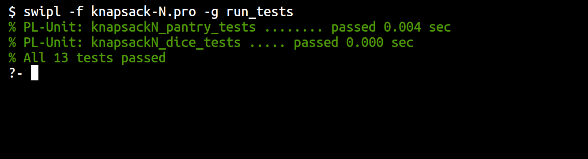
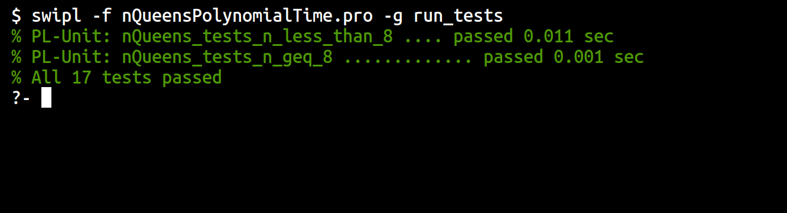

## Question 1

### Predicate

```prolog
/** 
 * solution(D, C, T, K): K is a set of items from D whose total weight is at 
 *                       most C and total value is at least T. 
 */
solution(Pantry, Capacity, Threshold, Knapsack) :-
  isSolution(Pantry, Capacity, Threshold, [], Knapsack).

isSolution(_, Capacity, Threshold, K, K) :- Capacity >= 0, Threshold =< 0.
isSolution(Domain, Capacity, Threshold, Knapsack, NewKnapsack) :-
  member(item(Item, W, V), Domain),
  NewC is Capacity - W,
  NewC >= 0,
  NewT is Threshold - V,
  isSolution(Domain, NewC, NewT, [item(Item, W, V) | Knapsack], NewKnapsack).
```

### Tests

#### Tests with Pantry

```prolog
:- begin_tests(knapsackN_pantry_tests).

pantry([
  item(apple,2,200),   item(bread,1,100),   item(peanuts,3,400),
  item(walnuts,4,500), item(lettuce,2,200), item(cookies,4,250),
  item(pasta,2,250),   item(cucumber,3,150)
]).

% Can repeat items
test(weight2_value200_2bread, [true]) :-
  pantry(P), Bread = item(bread, 1, 100),
  solution(P, 2, 200, [Bread, Bread]), !.

% Weight 0, Value 0 -> {}
test(weight0_value0, [true(K == [])]) :- pantry(P), solution(P, 0, 0, K), !.

% Weight 1, Value 200 -> false
test(weight1_value200, [fail]) :- pantry(P), solution(P, 1, 200, _).

% Weight 8, Value 2000 -> false
test(pantry_weight8_value2000, [fail]) :- pantry(P), solution(P, 8, 2000, _).

% Weight 3, Value 400 -> {(peanuts)}
test(weight3_value400) :-
    Expected = [[item(peanuts,3,400)]],
    pantry(P), findall(K, solution(P, 3, 400, K), KList),
    forall(member(K, KList), member(K, Expected)).

% Weight 4, Value 500 -> {(peanuts, bread), (walnuts), (pasta, pasta)}
test(weight4_value500) :-
    Expected = [
        [item(peanuts,3,400), item(bread,1,100)],
        [item(bread,1,100), item(peanuts,3,400)],
        [item(walnuts,4,500)],
        [item(pasta,2,250), item(pasta,2,250)]
    ],
    pantry(P), findall(K, solution(P, 4, 500, K), KList),
    forall(member(K, KList), member(K, Expected)).

% Weight 2, Value 200 -> {(apple), (lettuce), (pasta) or (bread, bread)}
test(weight2_value200) :-
    Expected = [
        [item(apple,2,200)], 
        [item(lettuce,2,200)], 
        [item(pasta,2,250)],
        [item(bread,1,100), item(bread,1,100)]
    ],
    pantry(P), findall(K, solution(P, 2, 200, K), KList),
    forall(member(K, KList), member(K, Expected)).

:- end_tests(knapsackN_pantry_tests).
```

#### Tests with Dice

```prolog
:- begin_tests(knapsackN_dice_tests).

dice([
    item(one, 1, 1),  item(two, 2, 2),  item(three, 3, 3),
    item(four, 4, 4), item(five, 5, 5), item(six, 6, 6)
]).

% 0 -> {}
test(dice_totaling_zero, [true(K == [])]) :- dice(D), solution(D,0,0,K), !.

% 1 -> {(1)}
test(dice_totaling_one, [true(K == [item(one,1,1)])]) :- dice(D),solution(D,1,1,K), !.

% 2 -> {(1, 1), (2)}
test(dice_totaling_two) :-
    Expected = [[item(one, 1, 1), item(one, 1, 1)],[item(two, 2, 2)]],
    dice(D), findall(K, solution(D, 2, 2, K), KList),
    length(KList, 2), forall(member(K, KList), member(K, Expected)).

% 3 -> {(1, 1, 1), (1, 2), (2, 1), (3)}
test(dice_totaling_three) :-
    Expected = [
        [item(one, 1, 1), item(one, 1, 1), item(one, 1, 1)],
        [item(one, 1, 1), item(two, 2, 2)],
        [item(two, 2, 2), item(one, 1, 1)],
        [item(three, 3, 3)]
    ],
    dice(D), findall(K, solution(D, 3, 3, K), KList),
    length(KList, 4), forall(member(K, KList), member(K, Expected)).

% 4 -> {(1, 1, 1, 1), (1, 1, 2), (1, 2, 1), (2, 1, 1), (1, 3), (3, 1), (2, 2), (4)}
test(dice_totaling_four) :-
    Expected = [
        [item(one, 1, 1), item(one, 1, 1), item(one, 1, 1), item(one, 1, 1)],
        [item(one, 1, 1), item(one, 1, 1), item(two, 2, 2)],
        [item(one, 1, 1), item(two, 2, 2), item(one, 1, 1)],
        [item(two, 2, 2), item(one, 1, 1), item(one, 1, 1)],
        [item(one, 1, 1), item(three, 3, 3)],
        [item(three, 3, 3), item(one, 1, 1)],
        [item(two, 2, 2), item(two, 2, 2)],
        [item(four, 4, 4)]
    ],
    dice(D),
    findall(K, solution(D, 4, 4, K), KList),
    length(KList, 8),
    forall(member(K, KList), member(K, Expected)).

:- end_tests(knapsackN_dice_tests).
```


### Test Results




## Question 2

I had to rewrite for it to evaluate $N > 8$ in reasonable time. Search space shrinks by 1 each step.

```prolog
/** intSeq(L, S, N, F): F is the sequence of ints from Start to N. */
intSeq(L, S, S, L).
intSeq(L, Start, N, NewL) :- 
  N > Start,
  N1 is N - 1, 
  intSeq([N | L],Start, N1,NewL).

legalList([], [], [], _, _).
legalList([R/C | T], Rows, Cols, DiagsP, DiagsS) :-
  member(R, Rows),
  member(C, Cols),
  PD is R - C,
  SD is R + C,
  member(PD, DiagsP),
  member(SD, DiagsS),
  select(R, Rows, NewRows),
  select(C, Cols, NewCols),
  select(PD, DiagsP, NewPDiags),
  select(SD, DiagsS, NewSDiags),
  legalList(T, NewRows, NewCols, NewPDiags, NewSDiags).

placement(L, N) :-
    length(L, N),
    NMinus1 is N - 1,
    NegN is 0 - N,
    TwoN is N * 2,
    intSeq([], 0, N, Seq),
    intSeq([], NegN, NMinus1, PrimaryDiags),
    intSeq([], 0, TwoN, SecondaryDiags), 
    legalList(L, Seq, Seq, PrimaryDiags, SecondaryDiags).
```

### Tests

#### $N < 8$

```prolog
:- begin_tests(nQueens_tests_n_less_than_8).

% 2x2: has no solutions
test(two_board, [fail]) :- placement(_, 2).

% 3x3: has no solutions
test(three_board, [fail]) :- placement(_, 3).

% 4x4: has all 2 valid solutions 
test(four_board, [true(subset([
  [1/2, 2/4, 3/1, 4/3], [1/3, 2/1, 3/4, 4/2]], SolutionList))]) :-
  findall(Solution, placement(Solution, 4), SolutionList).

% 5x5: has all 10 valid solutions
sortAllSubLists([], []).
sortAllSubLists([H|T], [SH|ST]) :- sort(H, SH), sortAllSubLists(T, ST).
test(five_board) :-
  AllSolutions = [
    [1/1, 2/3, 3/5, 4/2, 5/4], [1/1, 2/4, 3/2, 4/5, 5/3],
    [1/2, 2/4, 3/1, 4/3, 5/5], [1/2, 2/5, 3/3, 4/1, 5/4],
    [1/3, 2/1, 3/4, 4/2, 5/5], [1/3, 2/5, 3/2, 4/4, 5/1],
    [1/4, 2/1, 3/3, 4/5, 5/2], [1/4, 2/2, 3/5, 4/3, 5/1],
    [1/5, 2/2, 3/4, 4/1, 5/3], [1/5, 2/3, 3/1, 4/4, 5/2]
  ],
  findall(Solution, placement(Solution, 5), SolutionList),
  sortAllSubLists(AllSolutions, AllSolutionsSorted),
  sortAllSubLists(SolutionList, SolutionListSorted),
  forall(member(S, AllSolutionsSorted), member(S, SolutionListSorted)).

:- end_tests(nQueens_tests_n_less_than_8).
```

#### $N \geq 8$

```prolog
:- begin_tests(nQueens_tests_n_geq_8).

% 8x8 board: valid solutions included
test(eight_board1, [true]):- placement([1/1, 2/5, 3/8, 4/6, 5/3, 6/7, 7/2, 8/4], 8), !.
test(eight_board2, [true]):- placement([1/1, 2/6, 3/8, 4/3, 5/7, 6/4, 7/2, 8/5], 8), !.
test(eight_board3, [true]):- placement([1/1, 2/7, 3/4, 4/6, 5/8, 6/2, 7/5, 8/3], 8), !.

% 9x9: valid solutions included
test(nine_board1, [true]) :- placement([1/1,2/3,3/6,4/8,6/4,5/2,9/5,7/9,8/7], 9), !.
test(nine_board2, [true]) :- placement([1/2,2/4,3/1,4/7,5/9,6/6,7/3,8/5,9/8], 9), !.
test(nine_board3, [true]) :- placement([1/3,2/1,3/4,4/7,5/9,6/2,7/5,8/8,9/6], 9), !.
test(nine_board4, [true]) :- placement([1/3,3/4,2/1,4/7,5/9,6/2,7/5,8/8,9/6], 9), !.

% 10x10: valid solutions included
test(ten_board1, [true]) :- placement([1/1,2/3,3/6,4/8,5/10,6/5,7/9,8/2,9/4,10/7], 10), !.
test(ten_board3, [true]) :- placement([1/2,2/4,3/6,4/8,5/10,6/1,7/3,8/5,9/7,10/9], 10), !.
test(ten_board2, [true]) :- placement([1/3,2/1,3/6,4/9,5/5,6/10,7/8,8/4,9/2,10/7], 10), !.
test(ten_board4, [true]) :- placement([1/4,2/1,3/5,4/8,5/10,6/3,7/7,8/9,9/2,10/6], 10), !.

% 12x12: valid solutions included
test(twleve_board1, [true]) :- 
  placement([1/1,2/3,3/6,4/8,5/11,6/5,7/12,8/10,9/4,10/7,11/9,12/2], 12), !.
test(twelve_board3, [true]) :- 
  placement([1/3,2/1,4/9,3/6,5/12,6/10,7/4,8/2,9/5,10/8,11/11,12/7], 12), !.

:- end_tests(nQueens_tests_n_geq_8).
```

### Test Results

